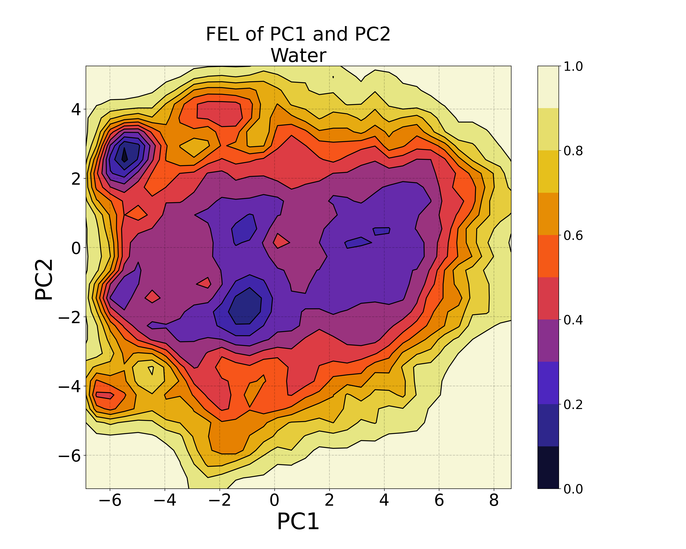
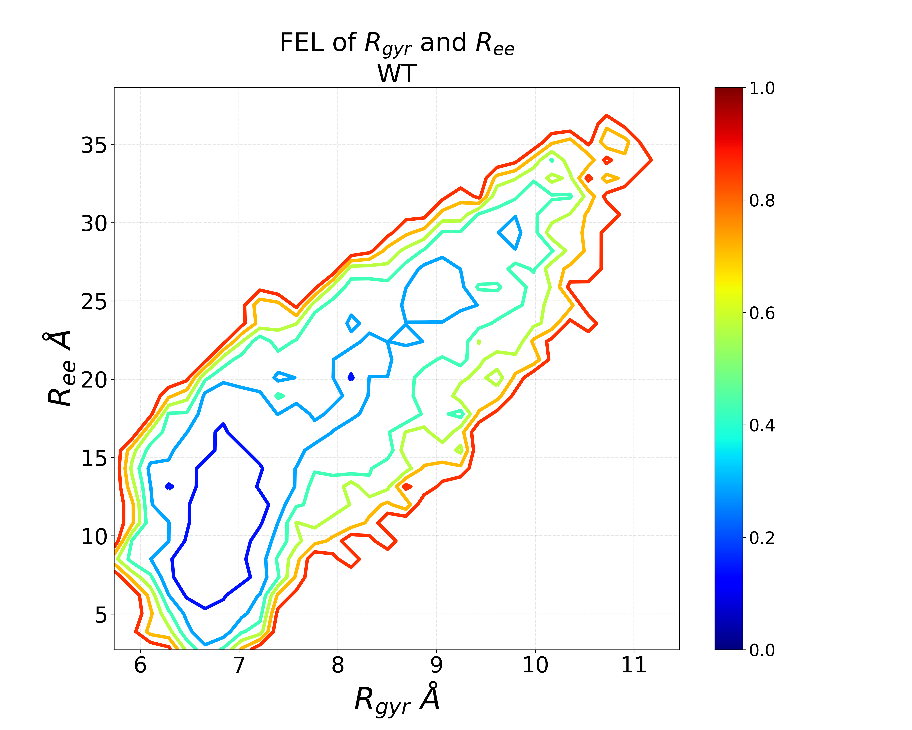

# My PC based FELs
This process was used to visualize the FEL of local protein regions that were characterized with StELa (https://github.com/DimaUClab/StELa-Protein-Structure-Clustering-Algorithm)

**S**econdary S**t**ructure **E**nsembles with Machine **L**e**a**rning

Published by: Amanda C. Macke - Dima Group @ University of Cincinnati
email for questions (amacke718@gmail.com)

StELa's flagship publication was: 
https://doi.org/10.1021/acs.jpcb.2c05288

where we used StELa to identify a ligand dependent conformational transition in a local region of the severing enzymes Katanin and Spastin.

We then compared its capabilities with other clustering-based algorithms in the following article:
bioRxv - 

We wanted to know how well each discussed method characterized the conformational space observed during simulation. These FEL's were used to determine this. In a previous publication by Cheung et al (https://doi.org/10.1021/acs.jpcb.8b08852) they described the free energy landscapes with a polymer scientist's favorite reaction coordinates (Rg & Ree); however we found these to be insufficient CVs. That being said, the following procedure can also be adapted to visualized the FEL in Rg & Ree space as well.

###################################################################################### 
## A Letter from StELa 
######################################################################################

Dear User, 

If you want to visualize and understand the conformational landscape of your system, it is very important to consider the descriptors of said space. One way machine learning techniques have made our lives easier is by providing dimension reduction tools that can be used on huge data sets - such as those produced by molecular dynamics simulations. In GROMACS, an essential dynamics analysis can be carried out (https://manual.gromacs.org/documentation/current/reference-manual/analysis/covariance-analysis.html) to identify those regions found to cover the most variance in the trajecotry. This can provide insight into those dominant motions that we find the most interesting as follows:

> gmx covar -f $TRAJ -s $GRO -o eigenvalues.xvg -v eigenvectors.trr -xpma covapic.xpm

> gmx anaeig -f $TRAJ -s $GRO -v eigenvectors.trr -last 1 -proj pc1.xvg

> gmx anaeig -f $TRAJ -s $GRO -v eigenvectors.trr -first 2 -last 2 -proj pc2.xvg

We then can use some bash to combine these files:
> paste pc1.xvg pc2.xvg  | awk '{print $1,$2,$4}' > ${NAME}-PC1PC2.xvg

Use GROMACS to calculate the Free Energy:
> gmx sham -f ${NAME}-PC1PC2.xvg -ls FES.xpm

This creates an .xpm file that can be converted into a .dat file with code sourced from google!
python2.7 xpm2txt.py -f FES.xpm -o free-energy-landscape.dat

Then we use Python to Plot it!

If you caluclate the Rg & Ree instead then you can use the following to combine them instead:

> paste RGYR.xvg REE-dist.xvg | awk '{print $1, $2, $7}' > RG_REE.xvg

Plot it with the alternative python code to get the lines instead:

## I hope this helps you plot FELs in the future!
## With Love, 
## StELa
